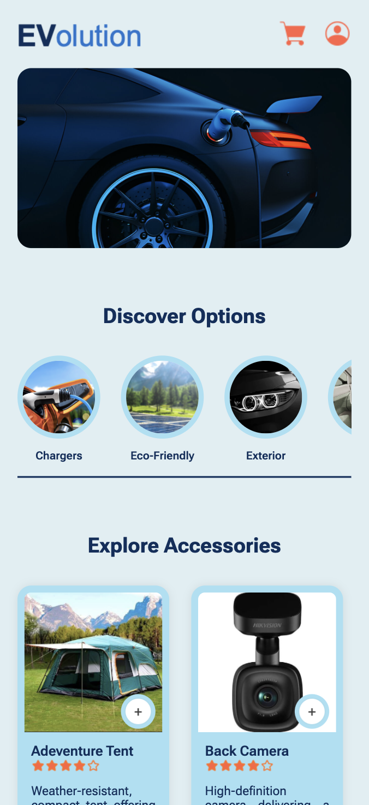
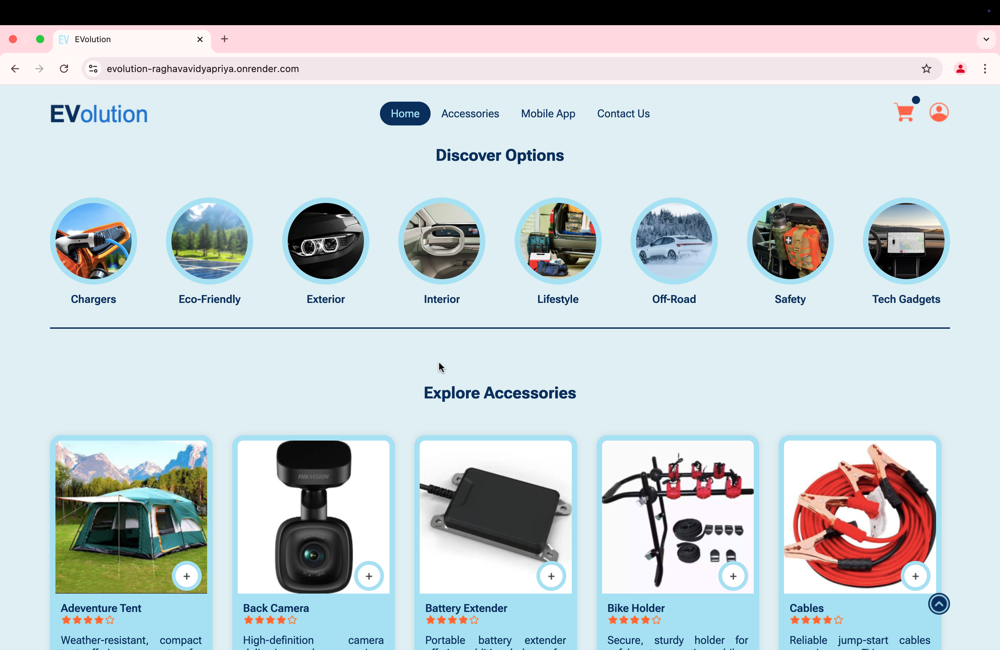
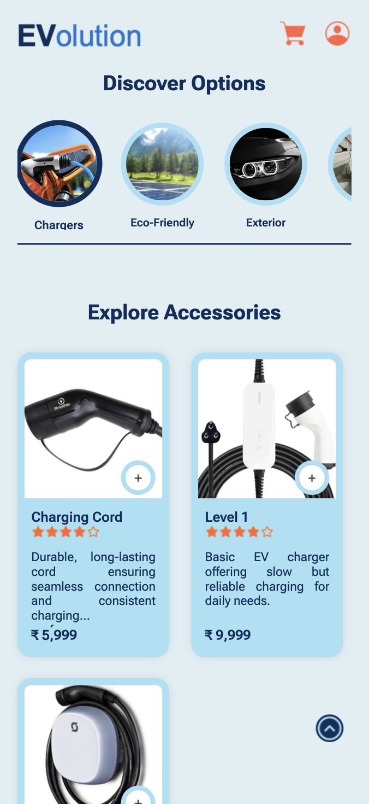
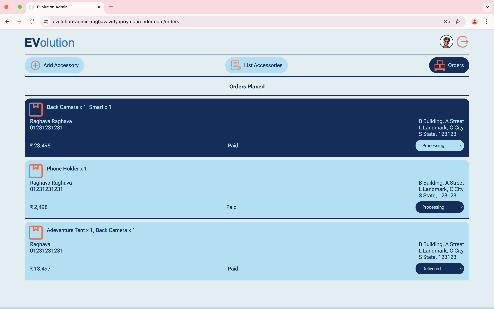

# EVolution

_Electric Vehicle Accessories E-Commerce Platform_
<br><br><br>

### 🌟 EXPERIENCE HERE 🌟

[https://evolution-raghavavidyapriya.onrender.com/](https://evolution-raghavavidyapriya.onrender.com/)
<br><br><br>

### PROTOTYPE VIDEO


https://github.com/user-attachments/assets/43ddf032-5f35-41df-bcd9-200f3236f487


<br><br>

### DOMAIN

Web Development
<br><br><br>

### OBJECTIVE

To provide a seamless and secure e-commerce platform for purchasing electric vehicle accessories, featuring an intuitive user interface, live order tracking, and reliable payment processing. It also aims to empower administrators with efficient tools for managing products, inventory, and orders, leveraging the scalability and performance of the MERN stack with a REST API.
<br><br><br>

### INTRODUCTION

EVolution is a modern e-commerce platform designed specifically for purchasing electric vehicle (EV) accessories. Built using the powerful MERN stack (MongoDB, Express.js, React.js, Node.js), it offers a seamless and secure shopping experience for EV enthusiasts. The platform features a visually appealing, user-friendly interface and a robust backend powered by a comprehensive REST API.

The REST API facilitates smooth communication between the frontend and backend, supporting endpoints for user authentication, product management, order handling, and payment processing. Key features include live order tracking, secure JWT-based authentication, and Stripe payment integration for reliable transactions. Administrators benefit from a dedicated admin panel with full CRUD operations to manage products, inventory, and orders effortlessly.

By leveraging the scalability and flexibility of the MERN stack alongside the REST API, EVolution addresses the growing needs of the EV market, delivering an innovative, full-stack solution for buyers and administrators. Hosted on Render, it ensures high performance and reliability for an enhanced EV accessory purchasing journey.
<br><br><br>

### FEATURES

- User Authentication: Secure login and registration with JWT-based authentication for customers.<br>
- Product Management: Admin panel for adding, updating, and deleting products.<br>
- Live Order Tracking: Customers can track their orders in real time.<br>
- Stripe Payment Integration: Secure and seamless payment processing for purchases.<br>
- CRUD Operations for Admin: Full Create, Read, Update, and Delete functionality for administrators to manage products and orders.<br>
- Responsive UI: Mobile-friendly and intuitive user interface built with React.js and Material UI.<br>
- Real-Time Notifications: Instant notifications for new orders and updates.<br>
- Secure Data Handling: Data protection with HTTPS, CORS, and secure APIs.
  <br><br><br>

### TECHNOLOGIES USED

##### Frontend:

- React.js: For building the dynamic user interface. <br>
- CSS: For a modern, responsive design.<br>

##### Backend:

- Node.js: Server-side JavaScript runtime.<br>
- Express.js: Web framework for building REST APIs.<br>
- JWT: For user authentication and authorization.<br>
- Stripe: For payment gateway integration.<br>

##### Database:

- MongoDB: NoSQL database for storing product and user data.<br>
- Mongoose: ODM (Object Data Modeling) for MongoDB interactions.<br>

##### Hosting & Deployment:

- Render: Cloud platform for hosting both frontend and backend. <br>
- MongoDB Atlas: Managed MongoDB cloud service.<br>

##### Development Tools:

- Git: Version control for collaboration and code management.
- Postman: For testing API endpoints.
  <br><br><br>

### END USERS

1. Electric Vehicle Owners
2. Dealers and Distributors
3. E-commerce Administrators
4. EV Support Staff
   <br><br><br>

### HOW TO EXECUTE

#### Terminal

```
git clone https://github.com/raghavavidyapriya/evolution.git
```

<br>

```
cd evolution/
```

<br>

#### Backend

```
cd backend/
```

<br>

```
npm install
```

<br>

```
node server.js
```

#### Backend Web Browser

```
http://127.0.0.1:4000/
```

<br>

#### Frontend

```
cd ../frontend
```

<br>

```
npm install; npm run build
```

#### Frontend Web Browser

```
http://127.0.0.1:5173/
```

<br>

#### Admin

```
cd ../admin
```

<br>

```
npm install; npm run build
```

#### Admin Web Browser

```
http://127.0.0.1:5174/
```

<br>

### OUTPUTS

#### USER

- Home Screen Desktop<br><br>
  

- Home Screen Mobile<br><br>
  

- Explore Screen Desktop<br><br>
  

- Explore Screen Mobile<br><br>
  

- Accessories Desktop<br><br>
  

- Accessories Mobile<br><br>
  

- App Download Desktop<br><br>
  

- App Download Mobile<br><br>
  

- Footer Desktop<br><br>
  

- Footer Mobile<br><br>
  

- Orders Desktop<br><br>
  

- Orders Mobile<br><br>
  

- Create Account Desktop<br><br>
  

- Create Account Mobile<br><br>
  

- Login Desktop<br><br>
  

- Login Mobile<br><br>
  

- Billing Desktop<br><br>
  

- Billing Mobile<br><br>
  

- Payment Desktop<br><br>
  

- Payment Mobile<br><br>
  

- Order Success Desktop<br><br>
  

- Order Success Mobile<br><br>
  

#### ADMIN

- Admin Login<br><br>
  

- Admin Login Mobile<br><br>
  

  - Admin Upload<br><br>
    

- Admin Upload Mobile<br><br>
  

- Admin List<br><br>
  

- Admin List Mobile<br><br>
  

  - Admin Orders<br><br>
    

- Admin Orders Mobile<br><br>
  

<br><br>

### FUTURE SCOPE

Expanding the product range to cover more EV-related accessories and integrating AI-driven product recommendations for a personalized user experience. Plans also include developing a mobile app, offering additional payment gateways, and expanding into international markets with multi-language support. Future enhancements will focus on advanced analytics, a subscription model, and integration with EV charging stations to offer a comprehensive solution for EV owners.
<br><br>

### DESIGNED & DEVELOPED BY

- RAGHAVA
  <br><br>

_END OF README_
